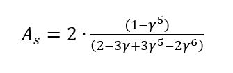
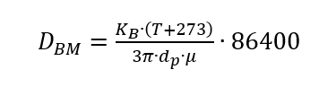

.. _ipython_directive:

========================================================================================================
Tutorial
========================================================================================================

Overview
========

Sutra is a python package to calculate the advective removal of microbial organisms 
(also called 'pathogens') from source to end_point.

Main features:
 - Includes database of removal parameters for microbial organisms. 
 - Calculate the removal and concentration of the microbial organism over distance, and with time   

The code is based on the equations given in chapter 6.7 of 
BTO 2012.015 "Gezondheidsrisico's van fecale verontreiniging" [in Dutch], pp 71-74. The equations used are
described below.

Background information
======================

During transport in the subsurface, microbial organism removal takes place by both attachment to the soil matrix and by inactivation.
The virus concentration 'C' [m-3] through steady-state transport of microbial organisms along pathlines in the saturated
groundwater can be approximated by:

.. image:: docs/source/_images/mrlp_20211018_equation1.PNG
  :width: 200
  :alt: Equation1: dC/dx + ((k_att + μ_1) / v) * C = 0

Where k_att + mu1 --> equal to removal rate 'lambda'
'k_att': attachment coefficient [day-1]
'mu1': inactivation coefficient [day-1] 
x: the distance traveled [m] 
v: the porewater velocity [m day-1] or 'darcyflux divided by the effective porosity'

Assuming that the background concentration of the relevant microbial organism equals 0,
the relative removal 'C_x/C0' can be calculated as follows.

.. image:: docs/_images/mrlp_20211018_equation2.PNG
  :width: 250
  :alt: Equation2: log(C_x/C_0) = -(((k_att + μ_1))/ln⁡(10)) * (x/v)

The attachment coefficient 'k_att' depends on the effective porosity 'epsilon', the grain diameter of the sediment 'd_c',
'sticky coefficient' alpha [day-1], the porosity dependent Happel's parameter 'A_s', diffusion constant 'D_BM' [m2 day-1], and
the porewater velocity [m day-1].

.. image:: ../docs/_images/mrlp_20211018_equation3.PNG
  :width: 250
  :alt: Equation3: k_att = 3/2 *(((1-ε))/d_c) * α*4*A_s^(1⁄3)*(D_BM/(d_c*ε*v))^(2⁄3) * v

The sticky coefficient alpha is determined by coefficient 'alpha0', which depends on both the soil type and the type of organism.
Alpha0 is being determined for a reference pH [pH0], e.g. pH=7.5.
Alpha relates to alpha0 as follows [corrected for different pH].

.. image:: _images/mrlp_20211018_equation4.PNG
  :width: 250
  :alt: Equation4: α = α_0 * 0.9^(((pH - pH_0) / 0.1))

The other parameters are calculated as follows:

Happel's porosity dependent parameter

Where:

.. image:: _images/mrlp_20211018_equation6.PNG
  :width: 250
  :alt: Equation6: γ = (1 - ε)^(1⁄3)

Boltzmann diffusion coefficient:

with Boltzmann constant K_B [1,38 × 10-23 J K-1], organism diameter d_p [m], water temperature T [degr C], 
and conversion factor 86,400 [s day-1].

The dynamic viscosity 'mu' [kg m-1 s-1] depends on the groundwater density 'rho'.
The water density is assumed to be 999.7 [kg m-3], representative for fresh groundwater in the Netherlands under a reference
temperature of 12 degrees centigrade.

.. image:: docs/_images/mrlp_20211018_equation8.PNG
  :width: 250
  :alt: Equation8: μ = (ρ * 497*10^(-6))/(T + 42.5)^(3⁄2) 

Steps
=========

Operating the microbial organism removal involves 2 steps:

#. Run/load the removal_functions.MicrobialRemoval class to retrieve the default microbial (removal) parameters, if present in the database.
Otherwise, an empty dataframe is returned.
#. Run removal_functions.calc_advective_microbial_removal to calculate the final concentration after a distance and time traveled.

Now, let’s try some examples. First we import the necessary python packages

.. ipython:: python

    import numpy as np
    import pandas as pd
    import os
    import sys
    from pathlib import Path
    import sutra.removal_functions as rf

Scenario A: Calculate removal of a microbial organism using default database parameters. 

.. ipython:: python

    ## Default removal parameters ##
    organism_name = "carotovorum"
    # Redox condition: 3 options ['deeply_anoxic','anoxic','suboxic']
    redox_cond = 'anoxic'
    # organism diameter [m]
    organism_diam = 1.803e-6
    # Starting concentration
    conc_start = 1.
    # Ambient groundwater concentration
    conc_gw = 0.
    # effective porosity
    por_eff = 0.33    
    # Sediment grainsize      
    grainsize = 0.00025
    # pH of the groundwater   
    pH_water = 7.5
    # Water temperature   
    temp_water = 10.
    # Water density [kg m-3]
    rho_water = 999.703
    # Distance traveled along pathline [m]
    distance_traveled = 100.
    # Time traveled [days]
    traveltime = 1.
    # Porewater velocity [m day-1]
    porewater_velocity = distance_traveled / traveltime

First initialize a class for calculating the removal of an organism.

.. ipython:: python

    mbo_removal_scenA = rf.MicrobialRemoval(organism = organism_name)
    removal_parameters = mbo_removal_scenA.removal_parameters
    # Return the (default) removal parameter values
    print(removal_parameters)

Calculate final concentration after advective microbial removal

.. ipython:: python

    # Calculate final concentration and print it
    C_final_default = mbo_removal_scenA.calc_advective_microbial_removal(grainsize = grainsize,
                                        temp_water = temp_water, rho_water = rho_water,
                                        pH = pH_water, por_eff = por_eff, 
                                        conc_start = conc_start, conc_gw = conc_gw,
                                        redox = redox_cond,
                                        distance_traveled = distance_traveled, 
                                        traveltime = traveltime)   
    print(C_final_default)
    # Print lambda (default): removal rate [day-1]
    print(mbo_removal_scenA.lamda)
    

Scenario B1: Manual input of removal parameters, not included in default database

.. ipython:: python

    ## Removal parmeters ##
    # Organism name
    organism_name = "MS2"
    # Redox condition: 3 options ['deeply_anoxic','anoxic','suboxic']
    redox_cond = 'anoxic'
    # alpha0: 'sticky coefficient' [-]
    alpha0 = 0.001 
    # Reference pH for calculating 'alpha' [-]
    # --> if pH == pH0, then collision efficiency alpha equals the value of alpha0
    pH0 = 7.5
    # time dependent inactivation coefficient 'mu1' [day-1]
    mu1 = 0.149
    # organism diameter [m]
    organism_diam = 2.33e-8

Add remaining 'ambient' input parameters

.. ipython:: python

    # effective porosity
    por_eff = 0.33    
    # Sediment grainsize      
    grainsize = 0.00025
    # pH of the groundwater   
    pH_water = 7.5
    # Water temperature   
    temp_water = 10.
    # Water density [kg m^-3]
    rho_water = 999.703
    # Distance traveled along pathline [m]
    distance_traveled = 100.
    # Time traveled [days]
    traveltime = 1.
    # Porewater velocity [m day-1]
    porewater_velocity = distance_traveled / traveltime
    # Starting concentration
    conc_start = 1.
    # Ambient groundwater concentration
    conc_gw = 0.
 
Initialize a class for calculating the removal of an organism

.. ipython:: python

    mbo_removal_B1 = rf.MicrobialRemoval(organism = organism_name)

Calculate (relative) concentration following advective microbial removal

.. ipython:: python

    C_final_B1 = mbo_removal_B1.calc_advective_microbial_removal(grainsize = grainsize,
                                        temp_water = temp_water, rho_water = rho_water,
                                        pH = pH_water, por_eff = por_eff, 
                                        conc_start = conc_start, conc_gw = conc_gw,
                                        redox = redox_cond,
                                        distance_traveled = distance_traveled, 
                                        traveltime = traveltime,
                                        organism_diam = organism_diam,
                                        mu1 = mu1,
                                        alpha0 = alpha0,
                                        pH0 = pH0 )
    # print final concentration
    print(C_final_B1)

Print the attachment coefficient 'k_att' and removal rate 'lambda'

.. ipython:: python

    # k_att, calculated
    print(mbo_removal_B1.k_att)
    # lambda, calculated
    print(mbo_removal_B1.lamda)

Scenario B2: An alternative way to enter removal parameters and calculate the final concentration
Should compare to previous input, be aware to enter the correct redox related values for 'anoxic' situation

.. ipython:: python

    mbo_removal_B2 = rf.MicrobialRemoval(organism = organism_name,
                alpha0_suboxic=None,
                alpha0_anoxic=0.001,
                alpha0_deeply_anoxic=None,
                pH0_suboxic=None,
                pH0_anoxic=pH0,
                pH0_deeply_anoxic=None,
                mu1_suboxic=None,
                mu1_anoxic=mu1,
                mu1_deeply_anoxic=None,
                organism_diam=organism_diam,
                )

Read removal parameters from 'removal_parameters'. Check these values as follows

.. ipython:: python

    removal_parameters = mbo_removal_B2.removal_parameters
    print(removal_parameters)

Calculate the final concentration, removal parameters for redox condition 'anoxic' (given by 'redox_cond')

.. ipython:: python

    # Only include 'ambient'/'physical' parameters (removal parameters loaded preiously)
    C_final_B2 = mbo_removal_B2.calc_advective_microbial_removal(grainsize = grainsize,
                                        temp_water = temp_water, rho_water = rho_water,
                                        pH = pH_water, por_eff = por_eff, 
                                        conc_start = conc_start, conc_gw = conc_gw,
                                        redox = redox_cond,
                                        distance_traveled = distance_traveled, 
                                        traveltime = traveltime)
    # k_att, calculated
    k_att = mbo_removal_B2.k_att
    # lambda, calculated
    lambda_rate = mbo_removal_B2.lamda
    # Final concentration
    print(C_final_B2)

Notice that the output concentrations C_final_B1 & C_final_B2 are equal

.. ipython:: python

    print(C_final_B1 == C_final_B2)